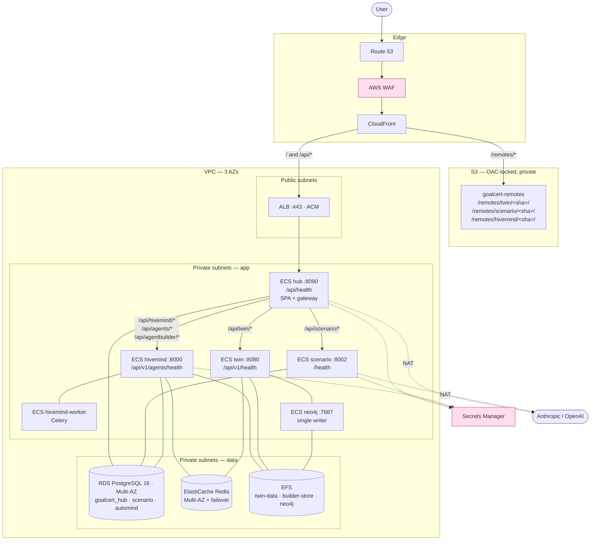

# Goalcert on AWS — production deployment runbook

Four repos, one product: the **Integration Hub** (host) composing **Digital Twin (NextXR)**,
**Scenario Engine** and **HiveMind** at runtime via Module Federation.

Production-grade throughout: Multi-AZ, no free tiers. Every claim here was verified against
the running local stack — anything unverified says so explicitly.

**Branches**: hub `hivemind` · twin `pivot/federation-skeleton` · scenario `simcore-react`
· hivemind `hivemind`.

---

## 0. Architecture



### The two rules that drive everything

1. **The browser fetches UIs from CloudFront but never touches a platform API.** Platform
   APIs sit in private subnets, reachable only from the hub's security group. That *is* the
   tenancy boundary: the Scenario Engine trusts `X-Goalcert-Org`, which is only trustworthy
   because the gateway is the sole ingress **and** `SCENARIO_API_KEY` is set.
2. **Remote URLs are baked into the hub bundle at build time.** Vite inlines
   `import.meta.env`, so `VITE_*_REMOTE` are Docker **build args**, not runtime env. A new
   remote URL means rebuilding the hub image.

### Deploy order

```
1. Foundation      VPC · RDS · ElastiCache · EFS · Neo4j · Secrets · ECR
2. Platform APIs   scenario · twin · hivemind (+ worker)      ECS, private
3. Remotes         build with VITE_REMOTE_BASE → S3 → CloudFront
4. Hub             LAST — it needs the remote URLs from step 3
5. Go-live config  §8 — seeding, first login, entitlements, bridges
```

---

## 1. Ports — canonical, read from each Dockerfile

| Service | **Container port** | Local dev | Health path | Note |
|---|---|---|---|---|
| hub | **8090** | 8090 | `/api/health` | JSON + DB check. **Never `/`** — §2.1 |
| scenario | **8002** | 8002 | `/health` | public by design (no API key needed) |
| twin | **8080** | 8080 | `/api/v1/health` | 200 `healthy` \| 200 `degraded` — never 503s |
| hivemind | **8000** | **8097** | `/api/v1/agents/health` | there is no `/health` |
| neo4j | 7687 bolt / 7474 http | same | bolt `RETURN 1` | never public |

> **The hivemind trap**: `8097` is only the docker-compose *host* mapping (`8097:8000`). The
> container listens on **8000**. Use 8000 in `portMappings`, `sg-hivemind`, and every
> `*_BASE_URL`. This has already cost one debugging session.

**No two services share a container port.** (On ECS `awsvpc` each task gets its own ENI, so
ports couldn't collide anyway — the map matters for **security groups and BASE_URLs**.)

---

## 2. Code prep — done, and why each was blocking

All uncommitted. **Commit before building images**; tag every image with the git SHA.

### 2.1 The hub had no health endpoint — the worst one
`/health` and `/healthz` fell through to the SPA catch-all and returned `index.html` with
**200, always**. An ALB check there **can never fail**: a task could lose its database
entirely and stay in service forever. Added `/api/health` — JSON, runs `SELECT 1`,
registered *before* the catch-all.
*Verified*: 200 healthy · **exit code 3** if the DB is unreachable at boot (ECS replaces the
task) · **503** if it dies after (ALB drains it).

### 2.2 The twin lost all state on every deploy — **this answers your database question**
The twin keeps **five SQLite databases plus the generated 3-D models** in a directory
computed from `__file__` — i.e. *inside the container image*:

| File | Holds |
|---|---|
| `data/twins.db` | **the twin registry — every twin a user created** (12 locally) |
| `data/changelog.db` | the governance change log |
| `data/bundles.db` | published agent bundles |
| `data/agent_checkpoints.db` | langgraph checkpoints |
| `data/track3_gate.db` | gate events |
| `data/scenes/` | **reconstructed Build-a-Twin 3-D models** |

Worse than ephemeral: the old `COPY nextxr-ontology/` **baked the .db files into the image**,
so a redeploy would serve a stale committed `twins.db` as the live registry — silently
reverting every twin, with no error anywhere.

Fixed: new `nextxr-ontology/paths.py` exposes `DATA_DIR`, overridable via **`NXR_DATA_DIR`**;
all six call sites use it; `.dockerignore` keeps state out of the image.
*Verified*: default path byte-identical (12 twins still listed, service healthy); override
relocates cleanly.

### 2.3 HiveMind Agent Builder — same class, bigger blast radius
Agents built in the 6-stage wizard are **JSON files** in `builder_store/`, hardcoded inside
the image. On ECS: (a) every customer-built agent disappears on redeploy, and (b) with >1
task, an agent created on task A **does not exist on task B** — a user-facing 404 that
depends on which task the LB picks.
Fixed: **`HIVEMIND_BUILDER_STORE`** → EFS.

### 2.4 `.env` was being baked into the HiveMind image
No `.dockerignore` existed in **any** repo, and automind's Dockerfile does `COPY . .` — so
`backend/.env` (Postgres credentials + LLM keys) shipped inside an image layer, readable by
anyone with pull access and persisting in ECR **after** you rotate the key.
Fixed: `.dockerignore` for every service. *Verified against the built image*: `.env` absent.

### 2.5 Dockerfiles were dev-grade
All four now: non-root (uid 10001), `$PORT`-driven, `HEALTHCHECK`, proxy headers,
`.dockerignore`, no build toolchain in the runtime layer (multi-stage where needed).
*Verified by running the images as ECS will* for hub, scenario and hivemind.
**The twin image builds, but its runtime probe is unverified** — the local Docker daemon
wedged mid-check (a known issue; see the twin's `RUN.md`). Run §9.1 against it before
trusting it.

### 2.6 Hub CSP
The hub sent no CSP. Adding one *without* naming the remote origins blocks federation in
production while working locally — so it is driven by **`REMOTE_ORIGINS`**, the same env the
remotes are configured from. Unset ⇒ no header (local unchanged; verified all three remotes
still mount).

### 2.7 Scenario on Postgres — verified
Never previously tested. Boots on Postgres, runs the `org_id` migration (**not** SQLite-only),
seeds every scenario from `definitions/`, runs a 6-node cascade. RDS works.

---

## 3. What each service actually needs

Answering directly: **no — Neo4j + Redis are not enough for the Digital Twin.** It is the
only service needing a graph DB, a cache/bus **and** durable file storage.

| Service | PostgreSQL | Redis | Neo4j | EFS | Why |
|---|---|---|---|---|---|
| **hub** | ✅ `goalcert_hub` | — | — | — | `organizations`, `users`, `audit_log` |
| **scenario** | ✅ `scenario` | — | — | — | scenarios + runs (org-scoped) |
| **twin** | — | ✅ event bus | ✅ **the graph** | ✅ **required** | 5 SQLite DBs + `scenes/` (§2.2) |
| **hivemind** | ✅ `automind` | ✅ Celery broker | — | ✅ **required** | agents, templates, executions, memory, workflows, users + `builder_store/` (§2.3) |
| **hivemind-worker** | ✅ | ✅ | — | — | Celery tasks |

Two "should be Postgres, currently isn't" items — deploy on EFS now, migrate later (§10).
Both force **desired count 1** on their service: SQLite over NFS is safe for one writer
only, and the builder store has no write locking.

---

## 4. Foundation

```bash
export AWS_REGION=ap-southeast-1
export ACCT=123456789012
export ECR=$ACCT.dkr.ecr.$AWS_REGION.amazonaws.com
export SHA=$(git rev-parse --short HEAD)
```

### 4.1 Network — 3 AZs

- **Public**: ALB, NAT gateways (**one per AZ** — a single NAT is an AZ-level SPOF).
- **Private / app**: every ECS service. Nothing public-facing.
- **Private / data**: RDS, ElastiCache, EFS mount targets.
- VPC endpoints for ECR, S3, Secrets Manager, CloudWatch Logs — keeps image pulls and
  secret reads off the NAT.

| SG | Inbound from | Port |
|---|---|---|
| `sg-alb` | 0.0.0.0/0 | 443 |
| `sg-hub` | `sg-alb` | 8090 |
| `sg-scenario` | **`sg-hub` only** | 8002 |
| `sg-twin` | **`sg-hub` only** | 8080 |
| `sg-hivemind` | **`sg-hub` only** | **8000** |
| `sg-neo4j` | **`sg-twin` only** | 7687 |
| `sg-rds` | `sg-hub`, `sg-scenario`, `sg-hivemind`, `sg-worker` | 5432 |
| `sg-redis` | `sg-twin`, `sg-hivemind`, `sg-worker` | 6379 |
| `sg-efs` | `sg-twin`, `sg-hivemind`, `sg-neo4j` | 2049 |

> If any platform SG admits the ALB or the internet, tenancy is gone — a caller could set
> its own `X-Goalcert-Org`. The gateway strips that header inbound, but **only the gateway
> does**.

### 4.2 RDS PostgreSQL — Multi-AZ

```bash
aws rds create-db-instance \
  --db-instance-identifier goalcert-pg \
  --engine postgres --engine-version 16 \
  --db-instance-class db.m6g.large \
  --allocated-storage 100 --max-allocated-storage 500 --storage-type gp3 \
  --multi-az \
  --master-username goalcert --manage-master-user-password \
  --vpc-security-group-ids sg-rds --db-subnet-group-name goalcert-data \
  --backup-retention-period 14 --preferred-backup-window 17:00-18:00 \
  --deletion-protection --storage-encrypted \
  --enable-performance-insights --performance-insights-retention-period 7 \
  --no-publicly-accessible
```

Create three databases: `goalcert_hub`, `scenario`, `automind` — separate databases, not
schemas (independent migration lifecycles).

> **SQLite is not an option for hub or scenario.** Both default to a local file; on Fargate
> that file dies with the task, taking every user and every authored scenario with it.

### 4.3 ElastiCache Redis — Multi-AZ

```bash
aws elasticache create-replication-group \
  --replication-group-id goalcert-redis \
  --replication-group-description "twin event bus + hivemind celery" \
  --engine redis --cache-node-type cache.m6g.large \
  --num-node-groups 1 --replicas-per-node-group 1 \
  --automatic-failover-enabled --multi-az-enabled \
  --at-rest-encryption-enabled --transit-encryption-enabled \
  --cache-subnet-group-name goalcert-data --security-group-ids sg-redis
```

> Use **separate logical DBs** — `/0` twin bus, `/1` Celery broker, `/2` Celery results. A
> `FLUSHDB` from one workload must not wipe the other. `--transit-encryption-enabled` means
> clients use `rediss://`.

### 4.4 EFS — required (§3)

```bash
aws efs create-file-system --encrypted --performance-mode generalPurpose \
  --throughput-mode elastic --tags Key=Name,Value=goalcert-efs
# One mount target PER AZ, in the data subnets, sg-efs.
```

Three **access points**, each with POSIX identity **uid/gid 10001** — the `appuser` the
images run as. If the access point owner doesn't match, the first write fails with
`Permission denied`:

| Access point | Path | Mounted at | Used by |
|---|---|---|---|
| `ap-twin-data` | `/twin-data` | `/data` | twin → `NXR_DATA_DIR=/data` |
| `ap-builder-store` | `/builder-store` | `/store` | hivemind → `HIVEMIND_BUILDER_STORE=/store` |
| `ap-neo4j` | `/neo4j` | `/data` | neo4j |

Enable **AWS Backup** on this file system. It holds your twin registry.

### 4.5 Neo4j — self-hosted on ECS

You want to run it yourself rather than Aura. Be clear-eyed: **Neo4j Community cannot
cluster**, so this is a **single-writer service** — one task, EFS-backed, restarted by ECS
on failure. That is the same availability profile as the twin's SQLite state (also
single-writer), so it doesn't make the twin *worse* — but it is not HA. For real HA, buy
**Neo4j Enterprise** or **AuraDB Business Critical**.

- ECS service, **desired count 1**, `neo4j:5-community` (or `5-enterprise` with a licence).
- EFS `ap-neo4j` → `/data`.
- Env: `NEO4J_AUTH=neo4j/<secret>`, `NEO4J_PLUGINS=["apoc"]`,
  `NEO4J_server_memory_heap_max__size=4G`, `NEO4J_server_memory_pagecache_size=2G`.
- Task: 2 vCPU / 8 GB.
- Cloud Map name `neo4j.goalcert.internal`; only `sg-twin` reaches 7687.
- **Never expose 7474/7687 publicly.**
- Set `deploymentConfiguration.maximumPercent=100` so a deploy stops the old task *before*
  starting the new one.

> Two tasks writing one EFS-backed Neo4j store **will corrupt it**.

### 4.6 Secrets Manager

```bash
aws secretsmanager create-secret --name goalcert/anthropic-api-key    --secret-string 'sk-ant-...'
aws secretsmanager create-secret --name goalcert/openai-api-key       --secret-string 'sk-proj-...'
aws secretsmanager create-secret --name goalcert/jwt-secret           --secret-string "$(openssl rand -hex 32)"
aws secretsmanager create-secret --name goalcert/scenario-api-key     --secret-string "$(openssl rand -hex 24)"
aws secretsmanager create-secret --name goalcert/hub-api-key          --secret-string "$(openssl rand -hex 24)"
aws secretsmanager create-secret --name goalcert/neo4j-password       --secret-string "$(openssl rand -hex 24)"
aws secretsmanager create-secret --name goalcert/super-admin-password --secret-string '<strong>'
```

> 🔴 **Rotate the Anthropic and OpenAI keys currently in `hub/backend/.env` before you
> deploy.** They are in plaintext on disk, were shared in chat, and (until §2.4) were being
> baked into an image layer.

Inject via the task definition's `secrets` block — **never** `environment`:

```json
"secrets": [
  { "name": "ANTHROPIC_API_KEY", "valueFrom": "arn:aws:secretsmanager:...:goalcert/anthropic-api-key" }
]
```

### 4.7 ECR

```bash
for r in goalcert-hub goalcert-scenario goalcert-twin goalcert-hivemind; do
  aws ecr create-repository --repository-name $r \
    --image-scanning-configuration scanOnPush=true \
    --encryption-configuration encryptionType=AES256
done
aws ecr get-login-password | docker login --username AWS --password-stdin $ECR
```

---

## 5. Platform APIs

All Fargate, **private subnets**, registered in **Cloud Map** (`*.goalcert.internal`) so the
hub addresses them by name.

### 5.1 Scenario Engine — desired count **2+** ✅

```bash
cd simulation-engine-standalone/backend
docker build -t $ECR/goalcert-scenario:$SHA . && docker push $ECR/goalcert-scenario:$SHA
```

Task: 1 vCPU / 2 GB. Health: `/health`.

| Env | Value |
|---|---|
| `PORT` | `8002` |
| `GOALCERT_DATABASE_URL` | `postgresql+psycopg://…/scenario` |
| `SCENARIO_API_KEY` | *secret* — **unset = allow-all = no tenancy** |
| `ANTHROPIC_API_KEY` | *secret* — AI authoring/revision (without it those two endpoints 422; everything else works) |
| `AUTHORING_MODEL` | `claude-opus-4-8` |
| `GOALCERT_CORS_ORIGINS` | leave empty — CloudFront serves the remote, not this service |

Migrations + seeds run at startup and are idempotent.

### 5.2 Digital Twin — desired count **1** ⚠️ (EFS/SQLite single-writer)

```bash
cd "Next XR/nextxr-ontology-v3"
docker build -t $ECR/goalcert-twin:$SHA . && docker push $ECR/goalcert-twin:$SHA
```

Task: 2 vCPU / 4 GB. Health: `/api/v1/health`. **EFS `ap-twin-data` → `/data`.**

| Env | Value |
|---|---|
| `PORT` | `8080` |
| **`NXR_DATA_DIR`** | **`/data`** — the EFS mount. Omit it and every twin is lost on redeploy (§2.2) |
| `NEO4J_URI` | `bolt://neo4j.goalcert.internal:7687` |
| `NEO4J_USER` / `NEO4J_PASSWORD` | `neo4j` / *secret* |
| `REDIS_URL` | `rediss://goalcert-redis…:6379/0` |

`deploymentConfiguration.maximumPercent=100` — two tasks must never share the EFS SQLite set.

### 5.3 HiveMind — desired count **1** ⚠️ (builder store) + worker

```bash
cd goalcert-automind/backend
docker build -t $ECR/goalcert-hivemind:$SHA . && docker push $ECR/goalcert-hivemind:$SHA
```

Task: 2 vCPU / 4 GB. Health: `/api/v1/agents/health`. **EFS `ap-builder-store` → `/store`.**

| Env | Value |
|---|---|
| `PORT` | **`8000`** (not 8097 — §1) |
| `DATABASE_URL` | `postgresql+asyncpg://…/automind` (**asyncpg**, not psycopg) |
| `REDIS_URL` | `rediss://goalcert-redis…:6379/1` |
| **`HIVEMIND_BUILDER_STORE`** | **`/store`** — omit it and every built agent is lost (§2.3) |
| `HUB_API_KEY` | *secret* — **set it.** Unset, it logs *"trusting X-Goalcert-User without verification. DEV-ONLY"* and believes any caller's identity |
| `ANTHROPIC_API_KEY` / `OPENAI_API_KEY` | *secrets* |

**Worker**: same image, `command: celery -A app.worker worker -l info`, same DB/Redis, no
EFS, no port, no ALB.

**Migrations**: the CMD runs `alembic upgrade head` on every task start. Fine for rolling
deploys; on **first** deploy run it as a one-off with the service at 0 rather than racing N
tasks:

```bash
aws ecs run-task --cluster goalcert --task-definition goalcert-hivemind \
  --overrides '{"containerOverrides":[{"name":"api","command":["alembic","upgrade","head"]}]}'
```

---

## 6. Remotes → S3 + CloudFront

Immutable path per git SHA. A platform UI ships without a hub deploy; rollback is a pointer
change.

- Private bucket `goalcert-remotes`, **Block all public access**, versioning on.
- CloudFront with **OAC** to the bucket. Never make the bucket public.
- `/remotes/*` → `Cache-Control: public, max-age=31536000, immutable` — safe *because* the
  path carries the SHA.
- The same distribution serves `/` and `/api/*` from the ALB (one origin for the browser).

`VITE_REMOTE_BASE` **must be the absolute CloudFront origin + path**. Wrong ⇒ chunks and
assets resolve against the *hub's* origin and 404 — a mounted-but-blank panel with no error.

```bash
export CF=https://d111abcdef8.cloudfront.net

cd simulation-engine-standalone/frontend
VITE_REMOTE_BASE=$CF/remotes/scenario/$SHA/ npm run build
aws s3 sync dist/ s3://goalcert-remotes/remotes/scenario/$SHA/ --cache-control "public,max-age=31536000,immutable"

cd "../../Next XR/nextxr-ontology-v3/frontend"
VITE_REMOTE_BASE=$CF/remotes/twin/$SHA/ npm run build
aws s3 sync dist/ s3://goalcert-remotes/remotes/twin/$SHA/ --cache-control "public,max-age=31536000,immutable"

cd ../../../goalcert-automind/frontend
VITE_REMOTE_BASE=$CF/remotes/hivemind/$SHA/ npm run build
aws s3 sync dist/ s3://goalcert-remotes/remotes/hivemind/$SHA/ --cache-control "public,max-age=31536000,immutable"
```

Each build emits `assets/remoteEntry.js` and a **stable, unhashed** `assets/style.css` — the
hub derives the CSS href by string-replacing `remoteEntry.js` → `style.css`, so that name
must never gain a hash.

```bash
for p in twin scenario hivemind; do curl -sI $CF/remotes/$p/$SHA/assets/remoteEntry.js | head -1; done
# all 200, content-type: application/javascript
```

---

## 7. Hub — built last

```bash
cd Goalcert_Hub
docker build -f hub/Dockerfile -t $ECR/goalcert-hub:$SHA \
  --build-arg VITE_TWIN_REMOTE=$CF/remotes/twin/$SHA/assets/remoteEntry.js \
  --build-arg VITE_SCENARIO_REMOTE=$CF/remotes/scenario/$SHA/assets/remoteEntry.js \
  --build-arg VITE_HIVEMIND_REMOTE=$CF/remotes/hivemind/$SHA/assets/remoteEntry.js \
  .
docker push $ECR/goalcert-hub:$SHA
```

Build from the **repo root** with `-f hub/Dockerfile` — the context needs both `hub/web` and
`hub/backend`. Task: 1 vCPU / 2 GB, **desired count 2+**.

| Env | Value |
|---|---|
| `PORT` | `8090` |
| `DATABASE_URL` | `postgresql+psycopg://…/goalcert_hub` |
| `JWT_SECRET`, `SUPER_ADMIN_PASSWORD`, `ANTHROPIC_API_KEY`, `OPENAI_API_KEY` | *secrets* |
| `CLAUDE_MODEL` | **`claude-sonnet-5`** |
| `CORS_ORIGINS` | `https://hub.example.com` |
| **`REMOTE_ORIGINS`** | `https://d111abcdef8.cloudfront.net` — the CSP allowlist |
| `TWIN_BASE_URL` / `TWIN_PATH_PREFIX` | `http://twin.goalcert.internal:8080` / `/api/v1` |
| `SCENARIO_BASE_URL` / **`SCENARIO_PATH_PREFIX`** | `http://scenario.goalcert.internal:8002` / **empty string** |
| `SCENARIO_API_KEY` | *secret* — must equal the engine's |
| `AGENTS_BASE_URL` / `AGENTS_PATH_PREFIX` | `http://hivemind.goalcert.internal:8000` / `/api/v1/agents` |
| `AGENTBUILDER_BASE_URL` / `AGENTBUILDER_PATH_PREFIX` | `http://hivemind.goalcert.internal:8000` / `/api/v1/builder` |
| **`HIVEMIND_BASE_URL`** / **`HIVEMIND_PATH_PREFIX`** | `http://hivemind.goalcert.internal:8000` / `/api` |
| `AGENTS_API_KEY` / `AGENTBUILDER_API_KEY` / `HIVEMIND_API_KEY` | HiveMind's `HUB_API_KEY` *(secret)* |

**Five settings that have already broken this system:**

1. **`SCENARIO_PATH_PREFIX` must be an empty string.** The engine mounts at the root
   (`/scenarios`, `/runs`). `/api` breaks every scenario call. Do not "fix" it.
2. **`HIVEMIND_*` must be set.** They were missing (left as `AUTOMIND_*` after the rebrand)
   → empty base → the gateway 503'd every call the HiveMind UI made.
3. **`REMOTE_ORIGINS`** — federation works locally with no CSP and dies in production
   without it.
4. **`CLAUDE_MODEL=claude-sonnet-5`.** `claude-sonnet-4-20250514` is retired: every call
   404s and the hub **silently falls back to OpenAI**, so "Claude" agents aren't Claude.
5. **There is no `HIVE_BASE_URL`.** `/api/hive/*` is the hub's own. A gateway entry for it
   shadowed the hub's routes and 503'd the entire Hive *and* the "Hub LLM Backend" probe.

### ALB

- Listener 443 (ACM) → target group → `sg-hub:8090`.
- **Health check path `/api/health`**, expect 200. **Not `/`** — that is the SPA catch-all
  and returns 200 HTML even with the database gone, so the check could never fail.
- Deregistration delay 30s; `deploymentConfiguration` 200/100 for zero-downtime rolls.

---

## 8. Go live — post-deploy configuration

The stack being up is not the product working. Do these in order.

### 8.1 Seed HiveMind templates
Without this the Agent Builder shows an **empty template list** — nothing runs it
automatically:
```bash
aws ecs run-task --cluster goalcert --task-definition goalcert-hivemind \
  --overrides '{"containerOverrides":[{"name":"api","command":["python","-m","seed.templates"]}]}'
# expect: "Seeded 34 vertical templates."  (37 total via the API)
```

### 8.2 First login + rotate the seeded admin
The hub seeds a super-admin from `SUPER_ADMIN_EMAIL` / `SUPER_ADMIN_PASSWORD` on first boot
with `must_change_password`. Log in once at `https://hub.example.com`, change it, confirm
the forced-change flow completes.

### 8.3 Create the real org + set entitlements
The super-admin has **`org_id = NULL`** — a platform-owner account, not a tenant. It sees
only shared/global data. Create the customer org in **Platform Owner → SuperAdmin console**,
then set entitlements. Valid modules:

```
twin · scenario · agentic · hivemind · frontline · supervisor
```

`agentbuilder` is **not** an entitlement — the Agent Builder is a HiveMind page, gated on
`hivemind`. Adding it does nothing.

### 8.4 Assign roles → personas
Roles map to personas (`personas.jsx`); the persona decides the nav:
- **`lnd`** — the only persona with the full scenario page set (Builder / Simulation / Train / Reports)
- **`compliance`** — Scenario Reports (the certified/not-certified evidence block)
- **`admin`** — Twins, Live Dashboard, Build a Twin, HiveMind
- `super_admin` sees none of these directly — use **Preview as** to check a persona's view.

### 8.5 Verify the integration bridges
These are the joins that make it one product rather than three tabs:
- **Domain bridge** — open a railway twin → Scenario Builder must offer **only Railway**
  faults, with railway conditions (Flooding, Heavy Rain). If it shows all verticals, the
  twin's domain isn't reaching the remote.
- **Router bridge** — Builder → *Run Simulation* moves the hub sidebar to Simulation, and
  you can navigate back. (If the sidebar stays put, users get trapped.)
- **Tenant isolation** — two users in different orgs: org A authors a scenario, org B must
  get a **404**, not a hidden row.

### 8.6 Known-broken at go-live — say so before a demo
- **3-D twin panel is blank inside the hub** (React #321 in the twin remote's
  `@react-three` stack under federation). Standalone renders fine; non-3-D twin surfaces
  are unaffected. §10.1.
- **The Hive's follow-up chat 404s** (`/followup` has no hub route). The main brief works.

---

## 9. Verification

### 9.1 Inside the VPC (bastion or one-off ECS task)
```bash
curl -s http://scenario.goalcert.internal:8002/health                # {"status":"ok"}
curl -s http://twin.goalcert.internal:8080/api/v1/health             # "healthy" (not "degraded")
curl -s http://hivemind.goalcert.internal:8000/api/v1/agents/health  # 200

# The engine must NOT be open — this is the tenancy boundary
curl -s -o /dev/null -w '%{http_code}\n' http://scenario.goalcert.internal:8002/scenarios?domain=railway
#   -> 401.  200 means SCENARIO_API_KEY is unset and any caller can pick its own tenant.

# Twin state is on EFS, not in the image
aws ecs execute-command --cluster goalcert --task <twin-task> --container api \
  --interactive --command "sh -c 'ls -la /data/twins.db && mount | grep /data'"
```

### 9.2 From the internet
```bash
curl --max-time 5 http://<twin-private-ip>:8080/api/v1/health     # must time out

curl -s https://hub.example.com/api/health | jq
#   status "ok", db.ok true, gateway.{twin,scenario,agents,agentbuilder,hivemind}.configured all true

curl -sI $CF/remotes/scenario/$SHA/assets/remoteEntry.js | head -1     # 200
curl -s -D- -o /dev/null https://hub.example.com/ | grep -i content-security-policy
#   script-src must list the CloudFront origin
```

### 9.3 In a browser, signed in
- All three remotes mount — no "failed to load" slot.
- Network: `remoteEntry.js` from **CloudFront**; every data call to **`/api/*` on the hub**
  — never a platform origin.
- The §8.5 bridges all pass.
- **Durability — the check people skip**: create a twin and build an agent → force a new
  deployment of both services → **both still exist**. That is what §2.2 / §2.3 bought.
- **Degrade**: stop the scenario service → scenario pages show the fallback slot, the rest
  of the hub stays up.
- **Federation proof**: rebuild one remote to a new SHA, flip the pointer → the hub reflects
  it with **no hub deploy**.

---

## 10. Known issues & follow-ups

| # | Issue | Impact | Fix |
|---|---|---|---|
| 1 | **3-D panel blank in hub** — React #321 from the twin remote's `@react-three` under federation; `useGLTF` throws before fetching. (The absolute-`model_url` half **is** fixed: `assetUrl()` rebases it, verified 200 via the gateway.) `singleton: true` is **not** the answer — `@originjs/vite-plugin-federation` doesn't implement it. | 3-D views blank in the hub only | Dedicated work on sharing `react-reconciler` / `@react-three` |
| 2 | **Twin state is SQLite on EFS** | Twin pinned to 1 task; no HA | Port the 5 DBs to RDS |
| 3 | **Builder store is JSON files on EFS** | HiveMind pinned to 1 task | Move agents into Postgres |
| 4 | **Neo4j Community can't cluster** | Single writer; restart = brief outage | Neo4j Enterprise / AuraDB Business Critical |
| 5 | **Scenario `_GRAPHS` in-memory** | Safe today — nothing reads it back (`POST /runs/graph` returns inline). Breaks the moment anything calls `GET /runs/graph/{id}` with >1 task | Persist it |
| 6 | **Hive follow-up 404** | Follow-up chat only | Implement `/api/hive/followup` |
| 7 | **`render.yaml` is stale** | Confusion | Delete — predates the rebrand, pins a retired model |

---

## 11. Rollback

| Layer | How |
|---|---|
| Remote (UI only) | The old SHA path is still in S3, untouched. Repoint the hub build arg, or flip the `current` pointer + invalidate. |
| Platform API | `aws ecs update-service --task-definition <prev-revision> --force-new-deployment` |
| Hub | Same — previous task revision |
| RDS | Snapshot / PITR. The `org_id` migration is additive and safe to re-run; a pre-tenancy snapshot re-migrates on boot |
| EFS | AWS Backup restore. **Holds the twin registry — verify the backup plan exists before go-live.** |
| Neo4j | Stop the task, restore the EFS path, start. Never two tasks on one store. |

---

## 12. CI

```
platform frontend push → build w/ VITE_REMOTE_BASE=$CF/remotes/<p>/$SHA/
                       → s3 sync to the SHA path → flip pointer → invalidate
                       ⇒ hub reflects it with ZERO hub deploys

platform backend push  → docker build → ECR:$SHA → ecs update-service

hub push               → build with the CURRENT remote SHAs as build args → ECR → ECS
```

The asymmetry is the payoff: platform UI and API changes ship without touching the hub. Only
a **contract** change needs both.
